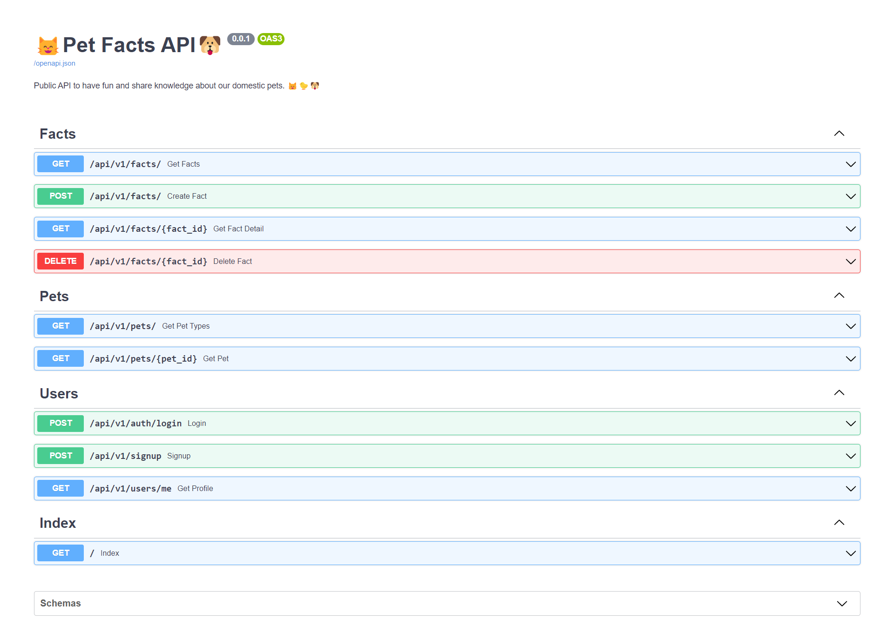

<h1 align="center" id="title">😸 Daily Pet Facts 🐶</h1>

Public API to have fun and share knowledge about our domestic pets. 😸🐤🐶

## 📑Table of Contents
- [�Table of Contents](#table-of-contents)
- [🚀 Demo](#-demo)
- [💡Features](#features)
- [🧑‍💻 Installation Steps](#-installation-steps)
- [The process](#the-process)
  - [🏗️ Build with](#️-build-with)
- [Licence](#licence)
- [Author](#author)

## 🚀 Demo

## 💡Features
Here're some of the projects's best features:
- Get a list of facts about our favorite pets. [🐥,🐥,🐥]
- Get the detail of a fact in specific. 🐥
- List a list with our best pest registered [🐤,😸,🐶]
- Get a pet detail 😸

## 🧑‍💻 Installation Steps
1. Clone the repository
2. Create your virtual enviromen with the command `py -m venv venv`
3. Install requirements in your virtual enviroment `pip install -r requirements.txt`
4. Create the env file in the root of the project `.env` and copy the content of the `.env.example` to configurate environment variables.

5. You can run the following command to buil the image. `$ docker-compose build`

6. Once the image is built, run the container: `$ docker-compose up -d`

7. If you want to be faster in launching the project you can use the following command to perform the above two steps in one. `$ docker-compose up --build`
8. Now go to http://127.0.0.1:8000/docs and enjoy the app.
##  The process
### 🏗️ Build with
Technologies used in this project:

- [Docker](https://www.docker.com/) 🐋
- [Python](https://www.python.org/) 🐍
- [FastAPI](https://fastapi.tiangolo.com/) 🚀
- [Pydantic ](https://pydantic-docs.helpmanual.io/) 💯
- [PostgreSQL](https://www.postgresql.org/) 🐘
- [SQLAlchemy](https://www.sqlalchemy.org/) ⚙️

To get started you just need to download docker on your machine, I leave the link right here. ➡️ [Docker](https://www.docker.com/get-started "Docker").

## Licence
> This project is licensed under the MIT License

## Author
Made with 💙 by [javieramayapat](https://www.linkedin.com/in/javieramayapat/)